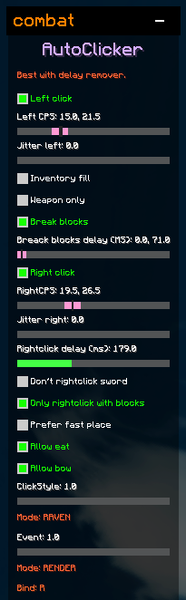

# Rundown

Modules in Raven are organised under categories. These consist of:

* Combat
* Render
* Movement
* Player
* Hotkey
* World
* Client
* Minigames
* Fun
* Debug
* Other

To open category, press on the "+" arrow nest to the category name.

.png>)

To open a module, to edit it's settings, right click it while hovering. And to enable the module, left click it, and it will turn a different colour.

.png>)

To modify the modules settings, drag sliders to change values, or check boxes to enable / disable features.&#x20;

In the case where a modules says "Mode: SOMETHING", left click on it to cycle through the modes.

To **bind** a module, click on the "Bind:" and then press a key on your keyboard.

To **unbind** a module, click on the "Bind:" and press **0** on your keyboard.

.png>)

